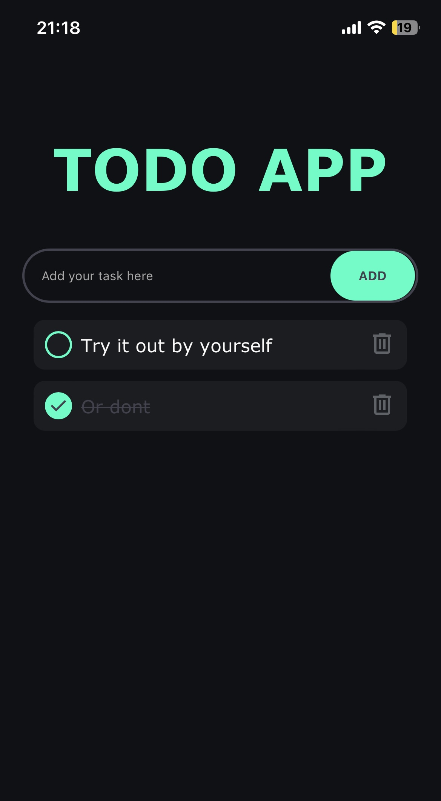
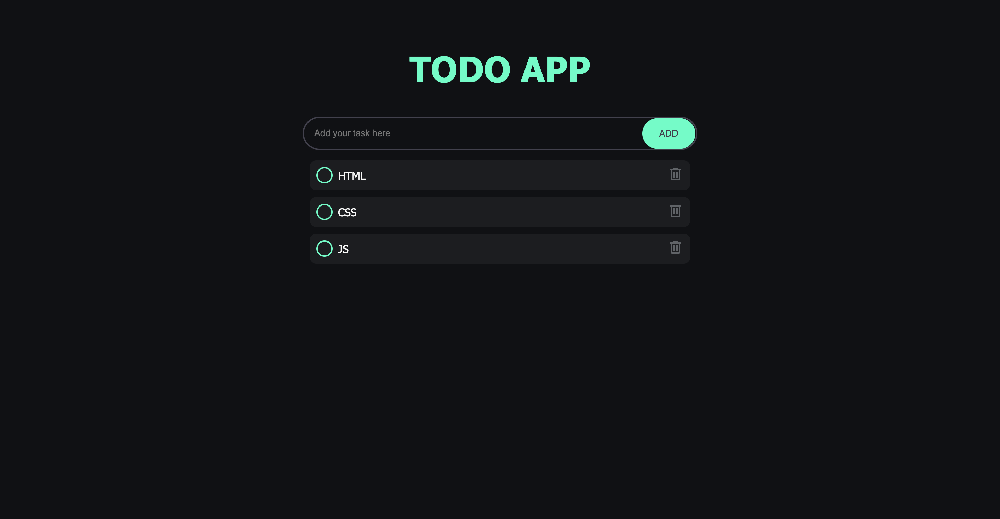

# To-Do List Application

A simple and efficient to-do list application to help you organize and keep track of your tasks.

## Features

- Add new tasks
- Mark tasks as completed
- Delete tasks
- Tasks are automatically saved in the browser's `localStorage`, ensuring they persist even after the page is refreshed

## Try the Application

You can test the application live here: [To-Do List Application](https://todolist-application-ten.vercel.app/)

## Technologies Used

- HTML
- CSS
- Vanilla JavaScript

## Local Storage

To ensure your tasks are saved between page reloads, the application uses the browser's `localStorage`. This means all tasks you add, mark as completed, or delete will remain the next time you open the application in the same browser.

## Screenshots

